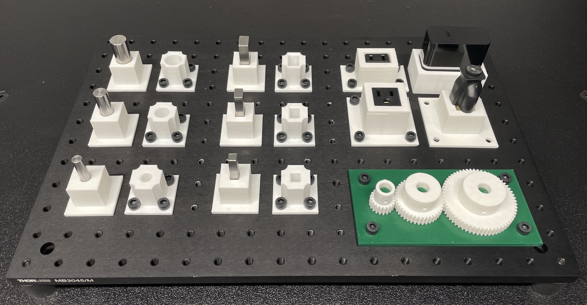

# IndustRealKit

This repo contains the assets used in [Tang and Lin, et al., "IndustReal: Transferring Contact-Rich Assembly Tasks from Simulation to Reality," Robotics: Science and Systems (RSS), 2023](https://arxiv.org/abs/2305.17110).


<br/><br/>

Specifically, this repo contains the following:
- 3D-printable STL files for all 3D-printed parts
- OBJ files for all 3D-printed parts (if you would like to import the assets into your simulator)
- Links to Onshape CAD documents for all 3D-printed parts (if you would like to modify the assets and export your own STL files)
- Purchasing information for all non-3D-printed parts

The files, documents, and information are organized by assembly type.

---

## Important Notes

Please read these notes prior to printing or using the assets.

### STL files
The STL files were exported directly from Onshape. We 3D printed these files on an Ultimaker 3 with [MatterHackers PLA filament](https://www.matterhackers.com/store/c/mh-build-series/mh-build-series-pla) at 0.15 mm layer resolution.

In general, 3D printers do not print features to the exact dimensions specified in STL files (e.g., due to overextrusion), and such deviations may vary from printer to printer. Thus, after printing the parts, we measured the diametral clearance between mating parts for the insertion task (i.e., between pegs and holes, and between gears and gearshafts) using calipers, and we observed a 0.5-0.6 mm clearance between the parts. Higher or lower clearances may have a significant impact on policy performance in the real world; **if you would like to closely reproduce the exact conditions used in the IndustReal paper, you should ensure that your printed parts also have clearances in this range.** To do so, you may have to modify the CAD documents to increase or decrease hole or shaft diameters, such that your printer ultimately achieves the desired clearance.
              
### OBJ files
The OBJ files were exported directly from Onshape for convenience. These are not the exact OBJ files used in the IndustReal policy training code, as those files were post-processed for use with our simulator. To access a subset of those files, please see [IndustRealSim](#related-repos).

By default, Onshape may tessellate certain surfaces with very few elements or use elements with extreme aspect ratios. When you use these meshes in a simulator, certain contact schemes may be insensitive to mesh quality, whereas others may be sensitive. We simulated physics using SDF-based contacts from [Factory](https://sites.google.com/nvidia.com/factory) in Isaac Gym. This contact scheme offers exceptional performance for contact-rich interactions, but is sensitive to mesh quality; for more information, see the Best Practices and Debugging section of the [Factory documentation](https://github.com/NVIDIA-Omniverse/IsaacGymEnvs/blob/main/docs/factory.md).

MTL files corresponding to each OBJ file are provided simply to add color during visualization.

### CAD documents
There are typically multiple tabs in each Onshape CAD document (i.e., one for each part studio), and each part studio may contain multiple configurations (e.g., for different sizes). If you do not immediately see a particular part, please check the tabs and configurations.

---

## Assets
- [Peg-and-hole assemblies](#peg-and-hole-assemblies)
- [Electrical connector assemblies](#electrical-connector-assemblies)
- [Gear assembly](#gear-assembly)
- [Optical breadboard](#optical-breadboard)
- [Franka fingers](#franka-fingers)
- [Camera and mount](#camera-and-mount)
- [Lighting](#lighting)

### Peg-and-hole assemblies
The pegs are initially located in the peg trays. The robot should remove the pegs from the peg trays and insert the pegs into the holes.
- Round pegs: [Misumi RGOCG8-50 8 mm peg](https://us.misumi-ec.com/vona2/detail/110300229270/?HissuCode=RGOCG8-50) | [Misumi RGOCG12-50 12 mm peg](https://us.misumi-ec.com/vona2/detail/110300229270/?HissuCode=RGOCG12-50) | [Misumi RGOCG16-50 16 mm peg](https://us.misumi-ec.com/vona2/detail/110300229270/?HissuCode=RGOCG16-50)
    - Note: These parts were sourced from [NIST Task Board 1](https://www.nist.gov/el/intelligent-systems-division-73500/robotic-grasping-and-manipulation-assembly/assembly)
- Round peg trays: [STL](pegs_and_holes/stl) | [OBJ](pegs_and_holes/obj) | [CAD](https://cad.onshape.com/documents/f557447261af1400663ecb0b/w/46e5f92db7037ba4a7fd83e8/e/1318185e774b27d33c05890f?configuration=List_7iyglZZdunGvla%3D_8mm&renderMode=0&uiState=64c067a4a86d2676af983322)
- Round holes: [STL](pegs_and_holes/stl) | [OBJ](pegs_and_holes/obj) | [CAD](https://cad.onshape.com/documents/f557447261af1400663ecb0b/w/46e5f92db7037ba4a7fd83e8/e/9cdb162bcb704b5caf09be83?configuration=List_7iyglZZdunGvla%3D_8mm&renderMode=0&uiState=64c067d6a86d2676af9833a0)
- Rectangular pegs: [Misumi KET8 8 mm peg](https://us.misumi-ec.com/vona2/detail/110300253950/?HissuCode=KET8) | [Misumi KET12 12 mm peg](https://us.misumi-ec.com/vona2/detail/110300253950/?HissuCode=KET12) | [Misumi KET16 16 mm peg](https://us.misumi-ec.com/vona2/detail/110300253950/?HissuCode=KET16)
    - Note: These parts were sourced from [NIST Task Board 1](https://www.nist.gov/el/intelligent-systems-division-73500/robotic-grasping-and-manipulation-assembly/assembly). They are currently only available in a length of 300 mm and must be cut to a length of 50 mm.
- Rectangular peg trays: [STL](pegs_and_holes/stl) | [OBJ](pegs_and_holes/obj) | [CAD](https://cad.onshape.com/documents/f557447261af1400663ecb0b/w/46e5f92db7037ba4a7fd83e8/e/28b8e7f34193d1ce34256852?configuration=List_TguglxgYfxAQPf%3D_8mm_min&renderMode=0&uiState=64c067e2a86d2676af9833ad)
- Rectangular holes: [STL](pegs_and_holes/stl) | [OBJ](pegs_and_holes/obj) | [CAD](https://cad.onshape.com/documents/f557447261af1400663ecb0b/w/46e5f92db7037ba4a7fd83e8/e/a626a3323fb03c1f4fb4d1d4?configuration=List_TguglxgYfxAQPf%3D_8mm_min&renderMode=0&uiState=64c067efa86d2676af9833c0)

### Electrical connector assemblies
The plugs are initially located in the plug trays, and the sockets are permanently press-fit into the socket trays. The robot should remove the plugs from the plug trays and insert the plugs into the sockets.

To install the sockets into the socket trays, we tapped them carefully with a rubber mallet.

- NEMA 2-prong plug: [Tensility International 16-00241 plug](https://www.digikey.com/en/products/detail/tensility-international-corp/16-00241/12756208)
- NEMA 2-prong plug tray: [STL](electrical_connectors/stl) | [OBJ](electrical_connectors/obj) | [CAD](https://cad.onshape.com/documents/d0894c3735d61c15bb6627d4/w/424e9225ddbc969dd68eb424/e/1977851b937601187a9c0202?renderMode=0&uiState=64c07f157a59111bc7eeedb2)
- NEMA 2-prong socket: [Schurter 4300.0705 socket](https://www.digikey.com/en/products/detail/schurter-inc/4300-0705/2644211)
- NEMA 2-prong socket tray: [STL](electrical_connectors/stl) | [OBJ](electrical_connectors/obj) | [CAD](https://cad.onshape.com/documents/d0894c3735d61c15bb6627d4/w/424e9225ddbc969dd68eb424/e/7c48625ab29dde1839367ed8?renderMode=0&uiState=64c07f217a59111bc7eeede3)
- NEMA 3-prong plug: [Qualtek Q-910 plug](https://www.digikey.com/en/products/detail/qualtek/Q-910/12809841)
- NEMA 3-prong plug tray: [STL](electrical_connectors/stl) | [OBJ](electrical_connectors/obj) | [CAD](https://cad.onshape.com/documents/d0894c3735d61c15bb6627d4/w/424e9225ddbc969dd68eb424/e/71cc010c499858a8b636f5be?renderMode=0&uiState=64c07f497a59111bc7eeee2f)
- NEMA 3-prong socket: [TE Connectivity 3-213598-2 socket](https://www.digikey.com/en/products/detail/te-connectivity-amp-connectors/3-213598-2/1892746)
- NEMA 3-prong socket tray: [STL](electrical_connectors/stl) | [OBJ](electrical_connectors/obj) | [CAD](https://cad.onshape.com/documents/d0894c3735d61c15bb6627d4/w/424e9225ddbc969dd68eb424/e/823d7c59ef90831fc7258bd9?renderMode=0&uiState=64c07f587a59111bc7eeee3b)
    - Note: We glued the socket tray lip on top of the socket tray with super glue (i.e., cyanoacrylate) after the socket was installed.

### Gear assembly
The gears and gear base are initially located on the work surface. The robot should pick up each gear and insert it onto the corresponding shaft on the gear base.

These parts are based closely on the gear assembly in [NIST Task Board 1](https://www.nist.gov/el/intelligent-systems-division-73500/robotic-grasping-and-manipulation-assembly/assembly).

- Small gear: [STL](gears/stl) | [OBJ](gears/obj) | [CAD](https://cad.onshape.com/documents/27b6adf9ac6d2fd277d36e9d/w/5eeb987aaf4ae2b80209542f/e/b98a41f9fee3c8fcc4b823e0?renderMode=0&uiState=64c0706b82880e0f200332be)
- Medium gear: [STL](gears/stl) | [OBJ](gears/obj) | [CAD](https://cad.onshape.com/documents/27b6adf9ac6d2fd277d36e9d/w/5eeb987aaf4ae2b80209542f/e/c8478593b2186b7c2c9764c6?renderMode=0&uiState=64c0706082880e0f200332b0)
- Large gear: [STL](gears/stl) | [OBJ](gears/obj) | [CAD](https://cad.onshape.com/documents/27b6adf9ac6d2fd277d36e9d/w/5eeb987aaf4ae2b80209542f/e/e5883046fcbb15117ae51c2c?renderMode=0&uiState=64c0705282880e0f2003328d)
- Gear base: [STL](gears/stl) | [OBJ](gears/obj) | [CAD](https://cad.onshape.com/documents/27b6adf9ac6d2fd277d36e9d/w/5eeb987aaf4ae2b80209542f/e/431be5d596cc1c7f5bbaf476?renderMode=0&uiState=64c055f3da9e4b6ad4037938)

### Optical breadboard
- Breadboard: [Thorlabs MB3045/M aluminum breadboard](https://www.thorlabs.com/thorproduct.cfm?partnumber=MB3045/M)
- Vibration-dampening feet: [Thorlabs AV4/M sorbothane feet](https://www.thorlabs.com/thorproduct.cfm?partnumber=AV4/M)
- Screws: [M6 socket-head screws](https://www.mcmaster.com/products/screws/system-of-measurement~metric/thread-size~m6/alloy-steel-socket-head-screws-8/thread-pitch~1-mm/finish~black-oxide/)

### Franka fingers
- Finger mold: [STL](finger_mold/stl) | [OBJ](finger_mold/obj)
    - Note: These parts were originally designed by [Karl Van Wyk](https://www.linkedin.com/in/karl-van-wyk-445387105) 
- Silicone rubber: [Smooth-On Dragon Skin 30 resin](https://www.smooth-on.com/products/dragon-skin-30/)

### Camera and mount
- Camera: [Intel RealSense D435](https://www.intelrealsense.com/depth-camera-d435/)
- Camera mount: [STL](camera_mount/stl) | [OBJ](camera_mount/obj)
    - Note: This part was originally designed by [Kenneth MacLean](https://www.linkedin.com/in/kennethmaclean)

### Lighting
- Light: [GTX Studio 85W LED](https://gtxproductsgroup.com/index.php?main_page=product_info&products_id=1373)
- Softbox: [Zuma octagonal CFL softbox](https://gtxproductsgroup.com/index.php?main_page=product_info&cPath=98_45&products_id=13)
- Light stand: [Zuma 3-section light stand](https://gtxproductsgroup.com/index.php?main_page=product_info&cPath=11&products_id=11)

---

## Additional Information

### Citing IndustRealKit
If you use any of the IndustRealKit assembly assets in your work, please consider citing the following paper:
```
@inproceedings{
    tang2023industreal,
    author = {Bingjie Tang and Michael A Lin and Iretiayo Akinola and Ankur Handa and Gaurav S Sukhatme and Fabio Ramos and Dieter Fox and Yashraj Narang},
    title = {IndustReal: Transferring contact-rich assembly tasks from simulation to reality},
    booktitle = {Robotics: Science and Systems},
    year = {2023}
}
```

If you use the Franka fingers or camera mount in your work, please acknowledge Karl Van Wyk or Kenneth MacLean, respectively.

### Related repos
- Isaac Gym (simulate robots): [paper](https://arxiv.org/abs/2108.10470) | [website](https://developer.nvidia.com/isaac-gym) | [environments repo](https://github.com/NVIDIA-Omniverse/IsaacGymEnvs)
- Factory (simulate contact-rich interactions in Isaac Gym): [paper](https://arxiv.org/abs/2205.03532) | [website](https://sites.google.com/nvidia.com/factory) | [environments repo](https://github.com/NVIDIA-Omniverse/IsaacGymEnvs/tree/main/isaacgymenvs/tasks/factory)
- IndustRealSim (reproduce RL policy training algorithms used in IndustReal): [paper](https://arxiv.org/abs/2305.17110) | [project website](https://sites.google.com/nvidia.com/industreal) | [code](https://github.com/NVIDIA-Omniverse/IsaacGymEnvs/tree/main/isaacgymenvs/tasks/industreal) | [shorter docs](https://github.com/NVIDIA-Omniverse/IsaacGymEnvs/blob/main/docs/rl_examples.md#industreal-transferring-contact-rich-simulation-tasks-from-simulation-to-reality) | [longer docs](https://github.com/NVIDIA-Omniverse/IsaacGymEnvs/blob/main/docs/industreal.md)
- IndustRealLib (reproduce RL policy deployment code used in IndustReal): [paper](https://arxiv.org/abs/2305.17110) | [project website](https://sites.google.com/nvidia.com/industreal) | [code](https://github.com/NVLabs/industreallib)

### Support
Please create a GitHub issue.
